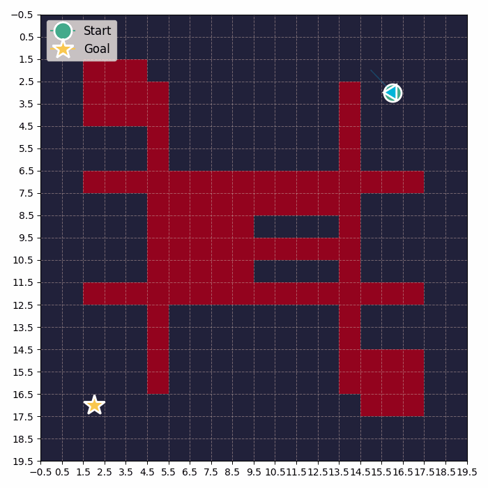

# Drone Path Planning and Obstacle Avoidance (RRT*)

This project demonstrates dynamic obstacle avoidance and optimal path planning for a drone using the RRT* (Rapidly-exploring Random Tree Star) algorithm in a 2D grid environment. The simulation visualizes the drone searching for a path from a challenging start point to a distant goal, navigating through complex, maze-like obstacles.

## Features
- **RRT* Algorithm**: Efficiently finds an optimal path from start to goal while avoiding obstacles.
- **Complex Environment**: Includes multiple walls, block clusters, and maze-like structures for realistic path planning challenges.
- **Drone Visualization**: The drone is animated as a blue triangle, moving along the planned path.
- **Beautiful Simulation**: The environment is rendered with a modern, visually appealing style.
- **Full Process Animation**: The entire path planning process is saved as a GIF and MP4 video, showing the tree growth and final path.

## Simulation Example



## How to Run
1. Install dependencies:
   ```bash
   pip install numpy matplotlib imageio
   ```
2. Run the simulation:
   ```bash
   python3 main.py
   ```
3. View the generated `simulation.gif` and `simulation.mp4` for the full planning process.

## Files
- `main.py`: Main entry point, runs the simulation and saves the animation.
- `environment.py`: Defines the grid, obstacles, rendering, and drone visualization.
- `agent.py`: Implements the RRT* path planning algorithm.
- `simulation.gif`/`simulation.mp4`: Animation of the planning process.
- `utils.py`: Utility functions (optional).

---

Feel free to use, modify, or extend this project for your own drone path planning and robotics research!
